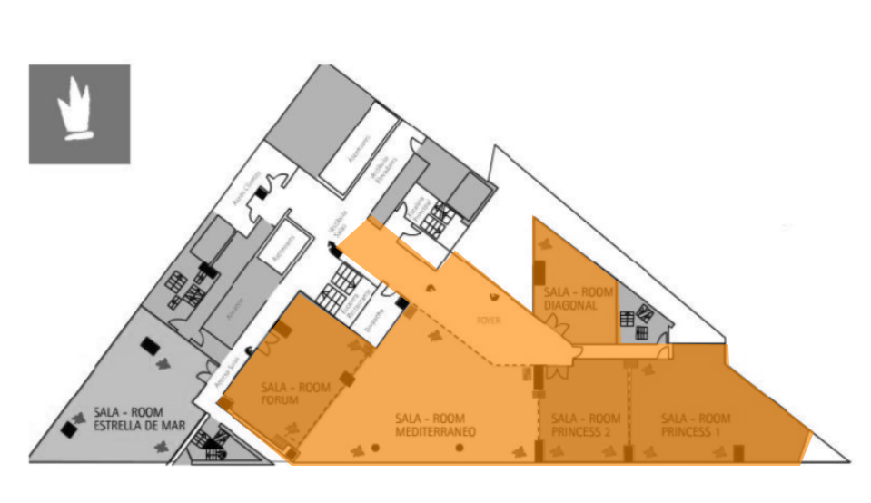

<script> 
    $(document).ready(function() { 
    $head = $('#header'); 
    $head.prepend('<A href = https://www.cuttingedge-events.com></A>') 
    }); 
</script> 


```{r echo=FALSE, message=FALSE,warning=FALSE}
library(readxl)
library(shiny)
library(dplyr)
library(knitr)
```


##  🏨  Accommodation 

### **Confirmed: Hotel Barcelona Princess**

**Barcelona Princess Hotel** is a 10-minute walk from the beach in the city’s Forum area. It offers wonderful views, a free sauna and a gym. Free WiFi is available throughout.

All guests have free access to the 2 heated outdoor pools. The one on the 23rd floor offers spectacular sea views.

Rooms at Princess Barcelona are elegant and bright. Each has contemporary décor. All rooms have satellite TV and offer free drinks from the minibar.

The bathrooms have a glass wall to separate the bed area from the sink but it is a black blind and the toilet and the shower are separated, each one with its own door.

**Princess Hotel Barcelona** is set on Avenida Diagonal, next to Diagonal Mar Shopping Centre. The tour bus stops in front of the hotel and Maresme Forum Metro Station is 100 m away.

  


<style>
p.comment {
background-color: #ffcc99;
padding: 10px;
border: 1px solid black;
border-radius: 5px;
}
</style>

<p class="comment">
**Confirmed 150 TWIN rooms, breakfast inc - 231€ VAT inc per room**.</p>


### Meeting rooms

Meeting rooms floor plan:

 

All the orange area is more than 400sqm . These meeting rooms are separated by panels so, for this activity they will be open making one space. Some of them have big windows so, as they will be open all the area will have natural lighting.

 


<style>
p.comment {
background-color: #ffcc99;
padding: 10px;
border: 1px solid black;
border-radius: 5px;
}
</style>

<p class="comment">
The cost of the rental of the space (Forum +  Mediterraneo + Princess 1 and 2+ Foyer + Diagonal) will be 2100€ VAT inc.</p>

<style>
p.comment {
background-color: #ffcc99;
padding: 10px;
border: 1px solid black;
border-radius: 5px;
}
</style>

<p class="comment">
Optional: AV needed to project during 20/30 minutes an introduction of the activity for the whole group at the same time, including different screens, soundsystem, technician: 1650€ VAT inc .</p>


****

## 🍽 El Principal de l'Eixample 

Located 50 meters from the famous La Pedrera and Paseo de Gracia, El Principal is a versatile space.

It is a stately main floor flooded with natural light thanks to its large windows. It has a magnificent interior courtyard is dividing the space in 2 but with good weather the whole venue has a capacity for 500 pax in cocktail style.

El Principal bases its cuisine in the traditional Catalan cuisine and seasonal products, and offer proposals developed especially for groups and special occasions. Also it has an extensive wine list.

On the basement it has a small private disco-club up to 150 pax, that can be used after dinner to extend the party.


    MENU
     
    Breadsticks with roasted corn, olive muffins, onion puff pastry, crunchy parmesan
    Mimolette (cheese) croquettes or  Roast beef, asparagus and ementhal roll or Garden tomatoes salad with anchovies and basil (to be chosen in advance)
    Foie Choux 
    Fried Artichokes - with romescu sauce
    Crispy sesame bread with smoked salmon
    Tomato soup Shot 
    Veal Carpaccio toast wit foie mousse and truffle vinaigrette,
    Sun-dried tomato, goat cheese and basil brick 
    Hummus with white tuna, sesame and soybeans 
    Bikinis
    Shrimp and green asparagus brochette (served separately) - keep asparagus vegan
    Truffle rigatoni and parmesan cheese 
    Mini-burgers with onion and mustard 
 
    Dark and white chocolate tart
    Mini cheesecake
    Lemon and merengue pie (with a lot of lemon curd)
    Strawberry and mint sorbet
    
    Coffee and tea 
    
    Ermita d'Espinells, D.O Penedés
    Sileo D.O. Montsant
    Cava Juvé i Camps
    Water, beer and soft-drinks

    Rates per person: 67€ VAT inc
    
    

## 🚌 Transfer rates 

  * 50 seater bus from Airport to La Mola: 330€ VAT inc per bus- we suggest contracting a minimum of 7 buses.
  * 21st October - 30 seater bus at disposal from 7.45h to 16.00h: 687€ VAT inc.
  * 24th October - 50 seater bus at disposal for dinner (4h - from Barcelona Princess to El principal and back): 440€ VAT inc per bus - 

  * Optional: a small bottle of water: 1,5€ VAT inc 
  
  
## 📸  Photo&Video {.tabset .tabset-fade .tabset-pills}


### Carta Grisa

https://cartagrisa.com

1 photographer + 2 camera man (1 fix camera for the meetings + 1 mobile )


      Day 1 - 22nd Oct - from 9 to 21h (12h)
      Photographer: 12h + 8 h photo edition: 560€ VAT inc
      Camera man 1 (9h to 21h): 12h + 12h video edition: 650€ VAT inc
      Camera man 2 (9h to 17h): 8h: 260€ VAT inc

      Day 2 - 23th Oct - from 9 to 21h (12h)
      Photographer: 12h + 10 h photo edition: 620€ VAT inc
      Camera man 1 (9h to 21h): 12h + 12h video edition: 650€ VAT inc
      Camera man 2 (9h to 12.30h): 4h: 160€ VAT inc

      Day 3 - 24th Oct - 4h (CSR activity)
      Photographer: 4h + 3 h photo edition: 250€ VAT inc
      Camera man 1: 4h + 6h video edition: 340€ VAT inc

      Material, transfer, preparation time, etc: 750€
      ____________________________________________________________________________________

      TOTAL: 3.490€ VAT inc

* If you want to add the dinner in Barcelona - photos + video you will need to add 600€ 

The pictures will be delivered 1 week after the event and the video 1 month later - if you need them earlier it will be a supplement

  * It is including 2 videos
    * 1 for the meetings with fixed camera + mobile
    * 1 of 3 minutes as resumé including all the activities of the event


### Gabriele Merolli


https://www.gabrielemerolli.com/en/

1 photographer + 1 camera man

    22nd Oct (9 to 17h - meeting)
    Photographer (inc photo edition): 968€ VAT inc
    Camera man.: 530€ VAT inc

    22nd Oct (dinner 19.00h to 21.30h) 
    Photographer (inc photo edition): 380€ VAT inc
    Camera man.: 300€ VAT inc

    23th Oct (9 to 12.30h - meeting )
    Photographer (inc photo edition): 425€ VAT inc
    Camera man.: 300€ VAT inc

    23th Oct (14.00h - 17.00h Team building)
    Photographer (inc photo edition): 425€ VAT inc
    Camera man.: 300€ VAT inc

    23th Oct (dinner 18.30h to 21.00h) 
    Photographer (inc photo edition): 380€ VAT inc
    Camera man.: 300€ VAT inc

    24th Oct (CSR activity - 4h)
    Photographer (inc photo edition): 484€ VAT inc
    Camera man.: 380€ VAT inc

    Video edition - meetings: 530€ VAT inc
    Video edition - resumé : 600€ VAT inc

    Transfers: 230€ VAT inc
    _________________________________________________________________________________

    TOTAL: 6.532€ VAT inc


*If you want to add the dinner in Barcelona - photos + video you will need to add 750€

All the material (photos and videos will be delivered 1 week after the event)

  * It is including 2 videos
    * 1 for the meetings with fixed camera.
    * 1 of 3/5 minutes as resumé including all the activities of the event

****

## Terms & Conditions

  *Rates valid for the requested dates.
  
  *Net rates for CICERON
  
  *Valid for 300 pax
  
  *Cutting Edge Events management fee including in the detailed rates
  
  *VAT included. 
  
  
    *Hotel Barcelona Princess Payment/cancellation policy:
  
    Deposits:
    40% before the 4th of June 2019
    30% before the 14th of June 2019
    30% before the 23th of September 2019
    

    Cancellations
    
    A 30% can be cancelled without cost from the confirmation until 14th June 2019
    A 10% can be cancelled without  cost from 15th June 2019 to 16th August 2019 
    A 5% can be cancelled without cost from 17th August to 22nd September
    From 23rd September the hotel will charge the 100% 

  
*****

